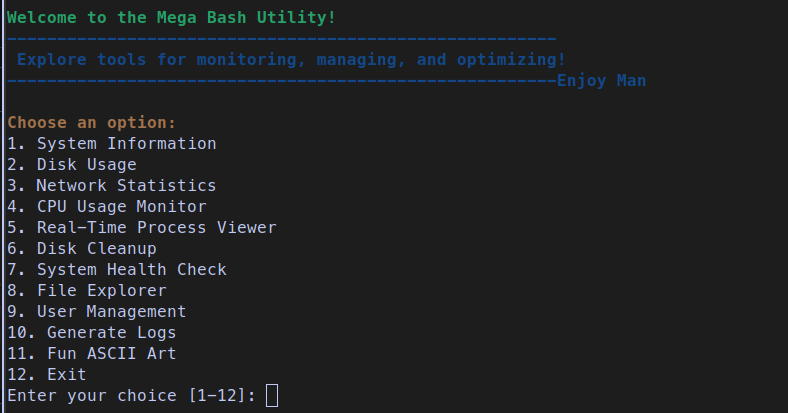
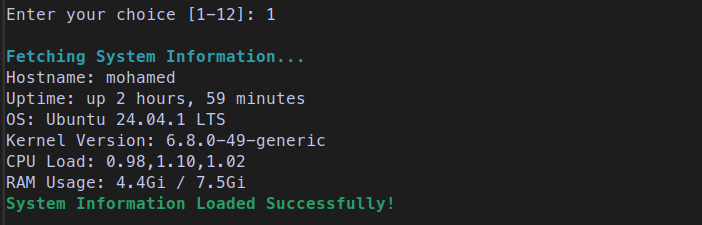
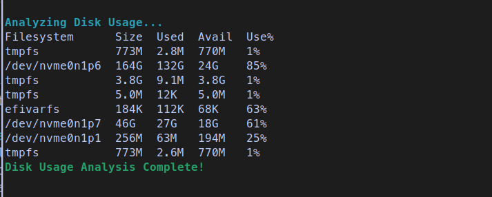

# Mega Bash Utility 🚀

The **Mega Bash Utility** is an all-in-one Bash script for system monitoring, management, and optimization. It combines powerful tools and user-friendly features to help you manage your Linux system efficiently.

---

## Features 🌟

1. **System Information**: Get details about your system, including uptime, kernel version, and memory usage.
2. **Disk Usage**: Analyze disk space usage in a clear, tabular format.
3. **Network Statistics**:
   - Active network connections.
   - Launch `iftop` for real-time bandwidth monitoring (optional).
4. **CPU Usage Monitor**: Monitor CPU utilization in real time.
5. **Real-Time Process Viewer**: View active processes dynamically using `top`.
6. **Disk Cleanup**: Free up space by clearing temporary files and cache.
7. **System Health Check**:
   - Check CPU temperature (requires `lm-sensors`).
   - Check disk health (requires `smartmontools`).
8. **File Explorer**: Explore directories and list file details interactively.
9. **User Management**: Add, list, or delete system users.
10. **Generate Logs**: View recent system and authentication logs.
11. **Fun ASCII Art**: Enjoy a light-hearted touch of creativity.

---

## Prerequisites 🛠️

Ensure the following tools are installed on your system:
- **iftop** (optional, for network bandwidth monitoring)
- **lm-sensors** (optional, for CPU temperature monitoring)
- **smartmontools** (optional, for disk health monitoring)
- Standard Linux utilities (`df`, `netstat`, `ls`, etc.)

Install missing dependencies with:
 
```bash
sudo apt update
sudo apt install iftop lm-sensors smartmontools -y
```

---

## Installation 📥

1. Clone the repository:
 
```bash
git clone https://github.com/yourusername/mega-bash-utility.git
```
2. Navigate to the script directory:
 
```bash
cd mega-bash-utility
```
1. Make the script executable:
 
```bash
chmod +x mega_bash_utility.sh
```

---

## Usage 📘

Run the script using: 

```bash
./mega_bash_utility.sh
```
Follow the interactive menu to explore various tools and features.

---

## Menu Options 📜

| Option | Description                                |
|--------|--------------------------------------------|
| 1      | View detailed system information           |
| 2      | Analyze disk usage                         |
| 3      | Fetch network statistics                   |
| 4      | Monitor real-time CPU usage                |
| 5      | View real-time processes                   |
| 6      | Perform a disk cleanup                     |
| 7      | Check system health (CPU/disk)             |
| 8      | Explore files and directories              |
| 9      | Manage users (add/list/delete)             |
| 10     | Generate and view recent system logs       |
| 11     | View fun ASCII art                         |
| 12     | Exit the utility                           |

---

## Screenshots 🖼️

| Feature                  | Screenshot Example                |
|--------------------------|-----------------------------------|
| Main Menu                |                           |
| System Information       |         |
| Disk Usage Analysis      |                |

---

## Contributing 🤝

Contributions are welcome! To contribute:

1. Fork the repository.
2. Create a feature branch:
   ```bash
   git checkout -b feature/new-feature
   ```
3. Commit your changes:
   ```bash
   git commit -m "Add new feature"
   ```
4. Push the branch:
   ```bash
   git push origin feature/new-feature
   ```
5. Open a pull request.

---

## Author ✍️  
Created with ❤️ by [Mohamed Zonkol](https://github.com/mohamedzonkol).  
For inquiries, email: mo.zonkol@gmail.com

